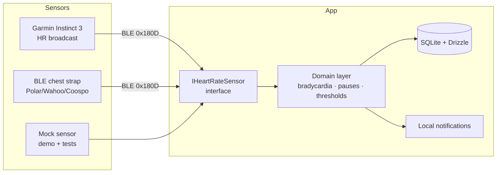

# HeartMonitor

Personal cardiac surveillance app for Android — continuous heart-rate monitoring with contextual bradycardia alerts, dropped-beat (pause) detection, and weekly reports.

> ⚠️ **Not a medical device.** This is a personal wellness/surveillance tool. It does not diagnose, treat, or replace professional cardiology follow-up.

## Why this exists

Mainstream wearables deliberately suppress low-heart-rate alerts during the user's sleep window (Garmin's abnormal-HR alert is explicitly disabled while you sleep — same pattern on Fitbit, Pixel Watch, Galaxy Watch). For someone with known bradycardia who wants to know if their heart rate drops *too* low overnight or during training, there is no off-the-shelf Android solution.

HeartMonitor fills that gap: it connects directly to any standard BLE heart-rate sensor — a Garmin watch in broadcast mode, or a chest strap — and applies **context-aware thresholds** (stricter rules awake, relaxed but supervised during sleep), logging every event with timestamps for cardiology review.

## Architecture

Local-first by design (see [ADR-001](docs/adr/0001-local-first-architecture.md)): cardiac data never leaves the device. No backend, no account, no cloud dependency.



The core abstraction is `IHeartRateSensor` ([ADR-002](docs/adr/0002-heart-rate-sensor-abstraction.md)) — every data source implements the same contract, so the app works with the mock for demos/CI, the watch for development, and a chest strap for production-grade overnight monitoring, with zero code changes.

## Tech stack

| Layer | Choice |
|---|---|
| Framework | Expo SDK 57, React Native 0.86, TypeScript strict |
| Routing | Expo Router (file-based, typed routes) |
| BLE | react-native-ble-plx (GATT Heart Rate Service 0x180D) |
| Local DB | expo-sqlite + Drizzle ORM (SQL migrations) |
| State | Zustand (persisted settings) |
| Alerts | expo-notifications (local, channel `heart-alerts`) |
| Tests | Jest + jest-expo — domain logic is pure and fully unit-tested |
| CI | GitHub Actions: lint + typecheck + test |
| Build | EAS Build (dev-client APK) |

## Project structure

```
src/
├── app/                # Expo Router screens (thin, composition only)
├── domain/             # Pure, platform-agnostic logic — unit tested
│   ├── heartRateParser.ts    # BLE 0x2A37 characteristic parser
│   ├── bradycardia.ts        # sustained low-HR state machine
│   ├── pauseDetection.ts     # dropped-beat detection via RR intervals
│   └── thresholds.ts         # day/night contextual floors
├── sensors/            # IHeartRateSensor contract + BLE + Mock impls
├── data/               # Drizzle schema, DB init, repositories
├── features/           # monitoring store (Zustand)
└── shared/             # notifications, theme, components
docs/adr/               # Architecture Decision Records
```

## Getting started

```bash
npm install
npm test            # unit tests (domain layer)
npm run lint        # eslint
npm run typecheck   # tsc --noEmit
```

### Development build (required — BLE doesn't work in Expo Go)

```bash
npx eas-cli login
npx eas-cli build --profile development --platform android
# install the resulting APK, then:
npm start
```

On the watch (Garmin Instinct 3): hold **MENU → Sensors & Accessories → Wrist Heart Rate → Broadcast Heart Rate**, or enable auto-broadcast inside the activity settings. The app will discover it as a standard BLE heart-rate sensor.

## Roadmap

- [x] **Phase 1** — sensor abstraction, BLE live HR, contextual bradycardia alerts, event persistence, mock sensor
- [ ] **Phase 2** — foreground service for all-night monitoring, auto-reconnect, morning reports
- [ ] **Phase 3** — Health Connect history sync, weekly report with PDF export
- [ ] **Phase 4** — Polar H10 ECG streaming (raw single-lead waveform, pause-context recording)
- [ ] **Phase 5** — optional caregiver alert via Telegram API (no backend needed)

## License

MIT — see [LICENSE](LICENSE).
